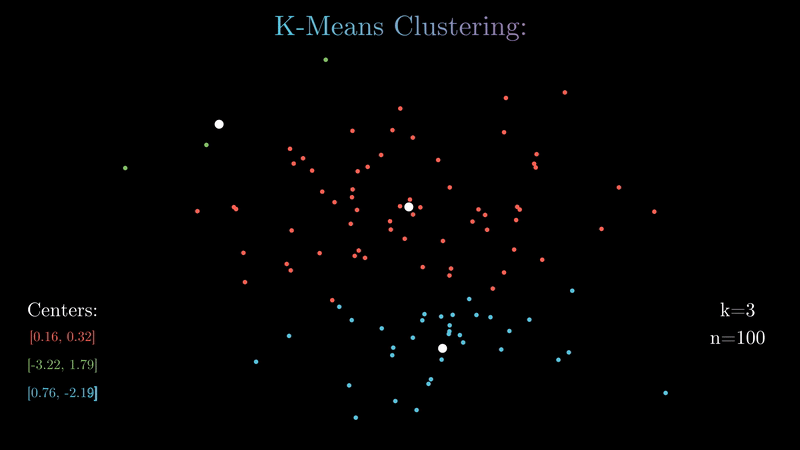

# K-Means Clustering with manim:

Animating the K-Means Clustering algorithm (written from scratch) in 2D using [3Blue1Brown](https://www.youtube.com/channel/UCYO_jab_esuFRV4b17AJtAw)'s math animation engine [manim](https://github.com/3b1b/manim) in Python.

## Visualisation:

* [1440p60](https://www.youtube.com/watch?v=PY9aAHro7UQ&feature=youtu.be) version on YouTube.

## Usage:
* Tune hyperparameters in ```animation_engine.py```
* Run ```manim animation_engine.py KMeansAnim -pl``` in a terminal in the repo folder.
* Output generated in  ```./media/videos/animation_engine/480p15```